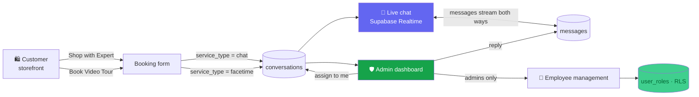

<div align="center">

# 🛍️ Personal Shopping Concierge

### A luxury-streetwear store with a real-time stylist in the browser — chat live, book a video tour, and run it all from a role-based back office.

Shoppers land on a curated **luxury-streetwear** storefront, then reach a human stylist two ways: **live chat** with messages streaming in real time, or a **FaceTime video-consultation** booking. Behind the scenes, staff handle every conversation from an **admin dashboard** with role-based access (admins vs. employees), live conversation assignment, and weekly product drops.


</div>

---

## ✨ Features

- **💬 Real-time customer ↔ store chat.** Customers start a conversation and messages stream both ways instantly over **Supabase Realtime** — no refresh, no polling.
- **🎥 Video-consultation booking.** Prefer a personal tour? Customers request a **FaceTime appointment** and the store follows up to confirm.
- **🕒 Live store-hours awareness.** Live chat is gated by configurable store hours — the storefront shows an **Open / Closed** badge and only opens chat while the store is in business.
- **🛡️ Role-based admin back office.** A protected dashboard lists every conversation, lets staff **assign conversations to themselves**, and reply in real time.
- **👥 Employee management (admins only).** Admins create employee logins, toggle each employee's **chat access**, and deactivate accounts — all guarded by Row-Level Security.
- **🔥 Weekly drops.** A storefront section surfaces the latest active product drops pulled live from the database.
- **🔔 Desktop notifications.** Staff get browser push notifications when a new, unassigned customer message arrives.
- **🎨 Polished, dark-hero UI.** React + shadcn/ui + Tailwind, with an Oswald/Inter type pairing and a luxury-streetwear aesthetic.

## 🧩 How it works



1. A customer picks **Live Chat** or **Video Consultation** on the storefront and submits the booking form.
2. The form inserts a row into `conversations`; a chat booking immediately opens an in-page **live chat** wired to a Supabase Realtime channel on the `messages` table.
3. Staff sign in at `/auth`, land on the **admin dashboard**, see the conversation appear in real time, **assign it**, and reply — every message round-trips through Realtime.
4. **Admins** additionally manage employees and roles; Postgres **Row-Level Security** decides who can read, assign, or administer.

## 🛠️ Tech stack

| Area | Tools |
|------|-------|
| **Frontend** | React 18 · TypeScript · Vite |
| **UI** | Tailwind CSS · shadcn/ui (Radix) · lucide-react · sonner |
| **Backend** | Supabase — Postgres, Auth, Realtime, Row-Level Security |
| **Data** | `conversations` · `messages` · `employees` · `user_roles` · `store_settings` · `weekly_drops` |
| **State / routing** | TanStack Query · React Router |
| **Auth model** | Email/password (username → `@internal.store`) with an `app_role` enum (`admin` / `employee`) |

## 🔐 Security & access

- **Row-Level Security everywhere.** RLS is enabled on every table. Customers can create and read conversations/messages; only authenticated staff can assign or update them, and only **admins** can manage employees and roles.
- **Roles, not booleans.** Access is driven by an `app_role` enum stored in a dedicated `user_roles` table and checked through a `has_role()` security-definer function — never by client-trusted flags.
- **Accounts are seeded securely — not hardcoded.** Admin and employee accounts are created the right way: an existing admin adds employees from the dashboard, or you seed the first admin via the **Supabase dashboard** (Authentication → Users) and grant the `admin` role in `user_roles`. There are **no hardcoded credentials and no bootstrap/reset backdoor** in this repository.
- **Secrets stay out of git.** The Supabase anon key and project URL live only in a local `.env` (ignored by git); a `.env.example` documents the variables. The service-role key is never used client-side and must never be committed.

> First-time setup: create your initial admin in the Supabase dashboard, then insert a matching `('<user_id>', 'admin')` row into `user_roles`. From there, manage all further staff inside the app.

## 📦 Getting started

```bash
# 1 — install dependencies
npm install

# 2 — configure environment
cp .env.example .env      # fill in your Supabase project values

# 3 — run the dev server
npm run dev               # http://localhost:5173
```

Apply the database schema with the Supabase CLI (creates all tables, RLS policies, and Realtime config):

```bash
supabase db push          # applies supabase/migrations/*
```

### Environment variables

| Variable | Where | Purpose |
|----------|-------|---------|
| `VITE_SUPABASE_URL` | `.env` (client) | Supabase project URL |
| `VITE_SUPABASE_PROJECT_ID` | `.env` (client) | Supabase project id |
| `VITE_SUPABASE_PUBLISHABLE_KEY` | `.env` (client) | Supabase **anon** (publishable) key — safe for the browser |

## 🗂️ Project structure

```
src/
  pages/
    Index.tsx                  # storefront: hero, services, weekly drops, footer
    Auth.tsx                   # employee/admin login
    Admin.tsx                  # role-gated dashboard shell (conversations + employees)
  components/
    BookingForm.tsx            # chat / facetime booking, store-hours gated
    LiveChat.tsx               # customer-side realtime chat
    AdminConversationList.tsx  # live conversation list + assign-to-me
    AdminChatView.tsx          # store-side realtime chat
    EmployeeManagement.tsx     # admin-only employee + role CRUD
    WeeklyDrops.tsx            # active product drops
    ui/                        # shadcn/ui primitives
  hooks/
    useStoreHours.ts           # open/closed from store_settings
    usePushNotifications.ts    # desktop alerts for new messages
  integrations/supabase/       # typed Supabase client
supabase/
  migrations/                  # schema, RLS policies, roles, realtime
  config.toml                  # Supabase project config
```

## 📄 License

[MIT](LICENSE) © 2026 Mohammed Abumtary

<div align="center"><sub>Built by <a href="https://github.com/Mohammed-AB">Mohammed Abumtary</a> · <a href="https://mohammed-ab.github.io">Portfolio</a></sub></div>
